<div align="center">


# Zero-Day PwnCrypt Ransomware Threat Hunt

### Microsoft Defender for Endpoint | Advanced Hunting | KQL | MITRE ATT&CK


</div>

---

## Overview

This project documents a threat hunt performed in Microsoft Defender for Endpoint during a simulated zero-day ransomware scenario involving PwnCrypt.

<div align="center">

<table>
<tr>
<td align="center">

<h3>🛡️ Cyber Range Scenario Credit 🛡️</h3>

<strong>This threat hunt scenario was provided by Josh Madakor, CEO of The Cyber Range.</strong>

<br><br>

<a href="https://www.skool.com/cyber-range">
  
</a>

</td>
</tr>
</table>

</div>

The investigation focused on identifying ransomware-style file activity, suspicious PowerShell execution, script behavior, affected files, device scope, network activity, Defender telemetry, and MITRE ATT&CK mappings.

---

## Scenario

A new ransomware threat named PwnCrypt was reported. The known indicator of compromise was file activity containing the string:

```text
pwncrypt
```

The objective of the hunt was to determine whether any devices in the environment showed evidence of PwnCrypt-related activity and whether the activity indicated ransomware execution, file impact, or possible data exfiltration.

---

## Hypothesis

If PwnCrypt ransomware executed in the environment, then affected devices may show:

- File creation, modification, or rename events containing `pwncrypt`
- Suspicious PowerShell execution
- Use of `ExecutionPolicy Bypass`
- Script execution from unusual locations such as `C:\ProgramData`
- Business-related files renamed with a ransomware marker
- Tool download or staging behavior
- Possible network activity around execution time

---

## Tools Used

| Tool | Purpose |
|---|---|
| Microsoft Defender for Endpoint | Endpoint detection and response |
| Advanced Hunting | Querying endpoint telemetry |
| KQL | Threat hunting query language |
| PowerShell | Observed attacker/script execution behavior |
| MITRE ATT&CK | TTP mapping |
| GitHub | Documentation and portfolio publishing |

---

## Key Findings

- `pwncrypt.ps1` was observed on the endpoint.
- Business-related files were renamed with the `pwncrypt` marker.
- `cmd.exe` launched `powershell.exe`.
- PowerShell used `-ExecutionPolicy Bypass`.
- PowerShell executed `C:\ProgramData\pwncrypt.ps1`.
- PowerShell telemetry showed tool/script download behavior.
- 7-Zip was downloaded and silently installed.
- Employee data was written to a temporary file.
- No clear evidence of successful external data exfiltration was confirmed during the reviewed network window.

---

## Investigation Steps

### Step 1 - Preparation and Hypothesis

The hunt began with a known indicator from the scenario: file activity containing `pwncrypt`. The working hypothesis was that a device affected by PwnCrypt would show suspicious file activity, PowerShell execution, and ransomware-style file impact.

No screenshot was taken for this step because it was the planning stage.

---

### Step 2 - Initial IOC Search for PwnCrypt Filenames

I searched `DeviceFileEvents` for filenames containing the known IOC string `pwncrypt`.

```kql
DeviceFileEvents
| where FileName contains "pwncrypt"
| summarize EventCount = count() by DeviceName, FileName
| order by EventCount
```

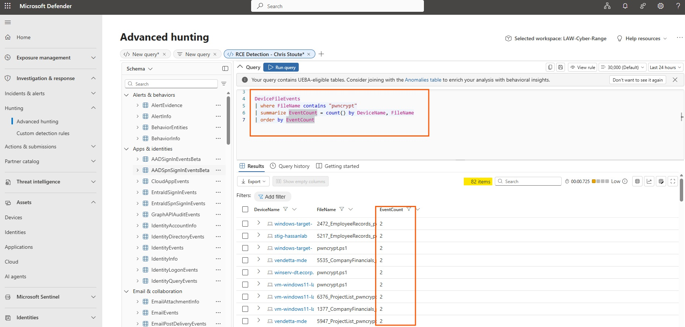

**Finding:** Multiple devices showed file activity containing `pwncrypt`, including `pwncrypt.ps1` and business-related CSV files renamed with the PwnCrypt marker.

---

### Step 3 - Raw File Event Timeline

After identifying the IOC, I removed the summary view and reviewed the raw file event timeline.

```kql
DeviceFileEvents
| where FileName contains "pwncrypt"
| project Timestamp, DeviceName, ActionType, FileName, FolderPath, InitiatingProcessFileName, InitiatingProcessCommandLine
| order by Timestamp asc
```

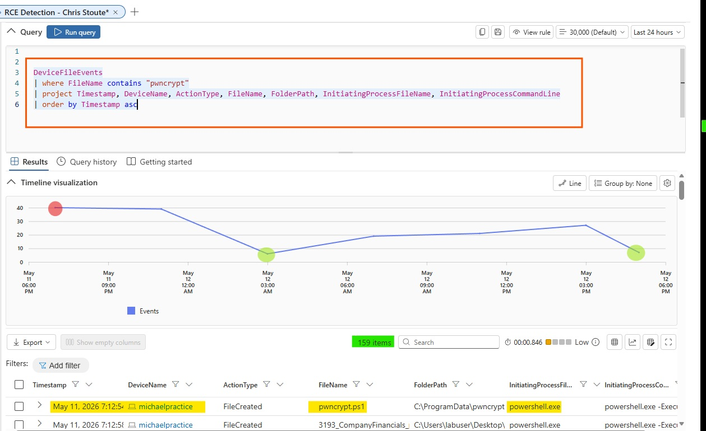

**Finding:** The raw timeline showed `pwncrypt.ps1` and several renamed files appearing across multiple devices. The activity was associated with PowerShell execution.

---

### Step 4 - Scope Investigation to My VM

Because this was a shared cyber range environment, I scoped deeper investigation and response actions to my own VM, `vendetta-mde`, instead of taking action on another student's device.

```kql
DeviceFileEvents
| where DeviceName == "vendetta-mde"
| where FileName contains "pwncrypt"
| project Timestamp, DeviceName, ActionType, FileName, FolderPath, InitiatingProcessFileName, InitiatingProcessCommandLine
| order by Timestamp asc
```

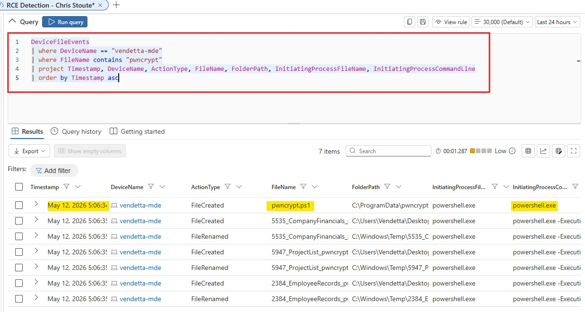

**Finding:** The `vendetta-mde` device showed PwnCrypt-related file activity, including `pwncrypt.ps1` and renamed business files.

---

### Step 5 - Pivot to Process Activity

After confirming file activity, I pivoted to `DeviceProcessEvents` around the suspicious timestamp to identify the process responsible.

```kql
let TargetDevice = "vendetta-mde";
let SuspiciousTime = datetime(2026-05-12T22:06:34.7444598Z);
DeviceProcessEvents
| where DeviceName == TargetDevice
| where Timestamp between ((SuspiciousTime - 10m) .. (SuspiciousTime + 10m))
| project Timestamp, DeviceName, AccountName, FileName, ProcessCommandLine, InitiatingProcessFileName, InitiatingProcessCommandLine
| order by Timestamp asc
```

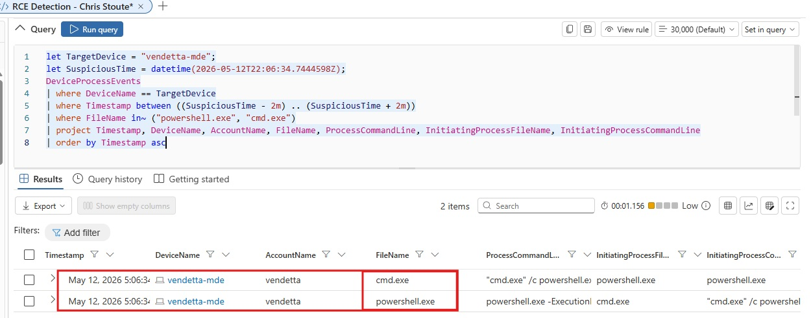

**Finding:** Process telemetry showed suspicious command-line activity involving `cmd.exe` and `powershell.exe` around the same time as the PwnCrypt file activity.

---

### Step 6 - Confirm PowerShell ExecutionPolicy Bypass

I narrowed the process query to focus on `cmd.exe` and `powershell.exe`.

```kql
let TargetDevice = "vendetta-mde";
let SuspiciousTime = datetime(2026-05-12T22:06:34.7444598Z);
DeviceProcessEvents
| where DeviceName == TargetDevice
| where Timestamp between ((SuspiciousTime - 2m) .. (SuspiciousTime + 2m))
| where FileName in~ ("powershell.exe", "cmd.exe")
| project Timestamp, DeviceName, AccountName, FileName, ProcessCommandLine, InitiatingProcessFileName, InitiatingProcessCommandLine
| order by Timestamp asc
```

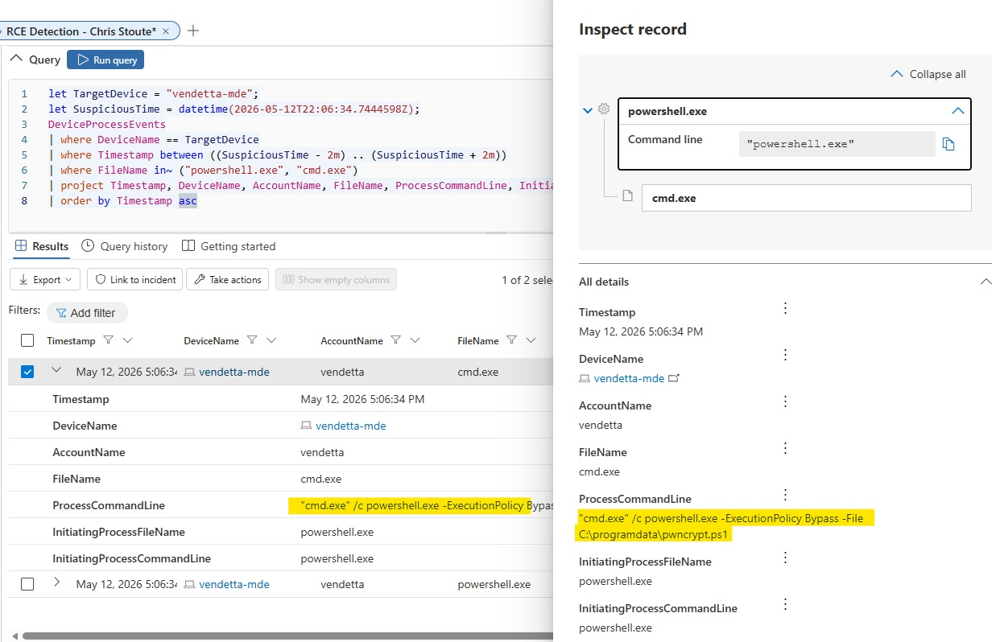

**Finding:** The process record showed `cmd.exe` launching PowerShell with execution policy bypass:

```text
cmd.exe /c powershell.exe -ExecutionPolicy Bypass -File C:\ProgramData\pwncrypt.ps1
```

This confirmed suspicious script execution from:

```text
C:\ProgramData\pwncrypt.ps1
```

---

### Step 7 - Identify Files Affected After Script Execution

After confirming execution, I reviewed file activity immediately after the suspicious PowerShell command ran.

```kql
let TargetDevice = "vendetta-mde";
let SuspiciousTime = datetime(2026-05-12T22:06:34.7444598Z);
DeviceFileEvents
| where DeviceName == TargetDevice
| where Timestamp between ((SuspiciousTime - 2m) .. (SuspiciousTime + 5m))
| where FileName contains "pwncrypt"
| project Timestamp, DeviceName, ActionType, FileName, FolderPath, InitiatingProcessFileName, InitiatingProcessCommandLine
| order by Timestamp asc
```

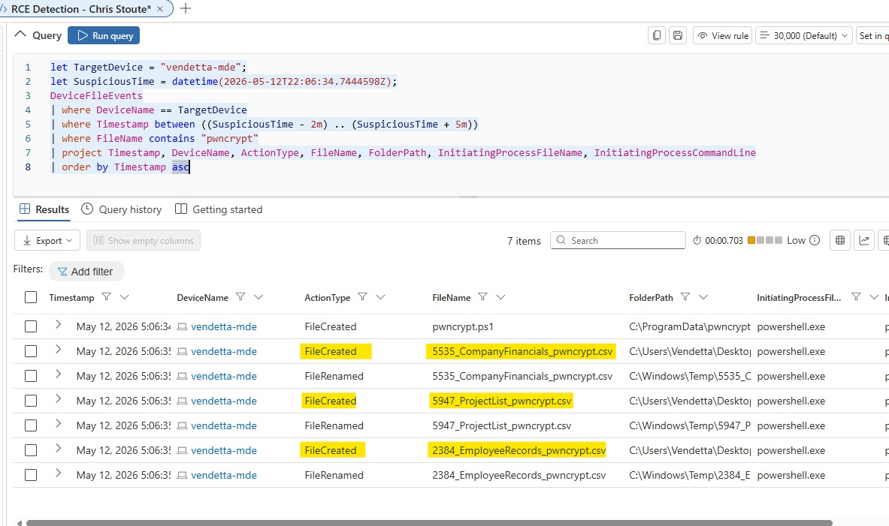

**Finding:** Business-related files were created or renamed with the `pwncrypt` marker after the script executed.

Examples:

```text
CompanyFinancials_pwncrypt.csv
ProjectList_pwncrypt.csv
EmployeeRecords_pwncrypt.csv
```

---

### Step 8 - Review File Rename Evidence

To determine whether original files were renamed, I reviewed activity involving the affected business filenames.

```kql
let TargetDevice = "vendetta-mde";
let SuspiciousTime = datetime(2026-05-12T22:06:34.7444598Z);
DeviceFileEvents
| where DeviceName == TargetDevice
| where Timestamp between ((SuspiciousTime - 2m) .. (SuspiciousTime + 5m))
| where FolderPath has_any ("CompanyFinancials", "ProjectList", "EmployeeRecords", "pwncrypt")
   or FileName has_any ("CompanyFinancials", "ProjectList", "EmployeeRecords", "pwncrypt")
| project Timestamp, DeviceName, ActionType, FileName, PreviousFolderPath, FolderPath, InitiatingProcessFileName, InitiatingProcessCommandLine
| order by Timestamp asc
```

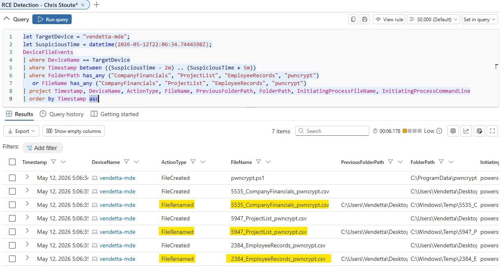

**Finding:** The file activity showed ransomware-style impact where business-related files were associated with the `pwncrypt` marker.

---

### Step 9 - Scope PwnCrypt Activity Across Devices

After confirming activity on `vendetta-mde`, I scoped the IOC across all devices to understand broader impact.

```kql
DeviceFileEvents
| where FileName contains "pwncrypt"
| summarize PwnCryptEvents = count(),
            FirstSeen = min(Timestamp),
            LastSeen = max(Timestamp),
            AffectedFiles = make_set(FileName, 10)
    by DeviceName
| order by PwnCryptEvents desc
```

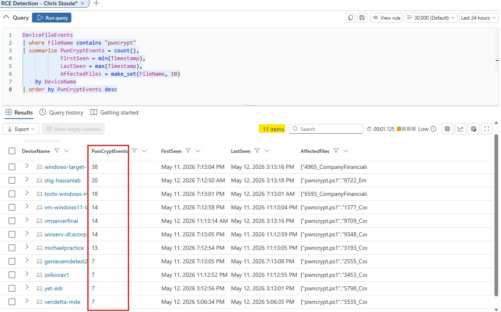

**Finding:** PwnCrypt-related activity appeared across multiple devices in the lab environment. `vendetta-mde` had confirmed related activity, but response actions were kept limited to my own VM.

---

### Step 10 - Review Network Activity Around Execution

I checked network activity around the suspicious execution time to determine whether there was obvious command-and-control or exfiltration activity.

```kql
let TargetDevice = "vendetta-mde";
let SuspiciousTime = datetime(2026-05-12T22:06:34.7444598Z);
DeviceNetworkEvents
| where DeviceName == TargetDevice
| where Timestamp between ((SuspiciousTime - 5m) .. (SuspiciousTime + 10m))
| project Timestamp, DeviceName, InitiatingProcessFileName, InitiatingProcessCommandLine, RemoteIP, RemoteUrl, RemotePort, RemoteIPType, ActionType
| order by Timestamp asc
```

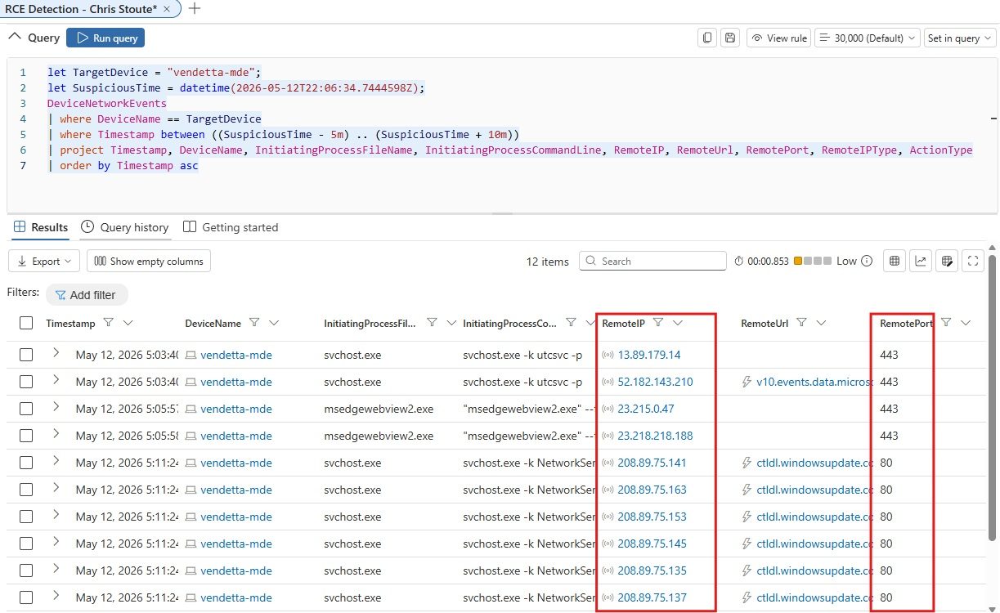

**Finding:** Network activity was observed, mostly involving common Windows/Microsoft-related traffic over ports `80` and `443`. No clear evidence of successful external data exfiltration was confirmed during this window.

---

### Step 11 - Review Defender Alert Evidence

I reviewed Defender alert evidence around the suspicious time period.

```kql
let TargetDevice = "vendetta-mde";
let SuspiciousTime = datetime(2026-05-12T22:06:34.7444598Z);
AlertEvidence
| where DeviceName == TargetDevice
| where Timestamp between ((SuspiciousTime - 30m) .. (SuspiciousTime + 30m))
| project Timestamp, DeviceName, Title, Categories, AttackTechniques, EntityType, EvidenceRole
| order by Timestamp asc
```

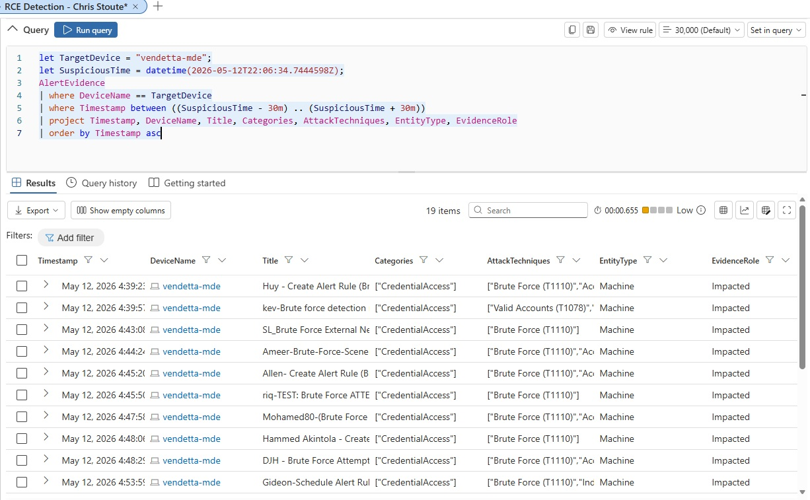

**Finding:** Defender showed existing alert evidence related to brute-force activity, but no clear alert directly tied to PwnCrypt ransomware execution during the reviewed window.

---

### Step 12 - Review AV or Threat Detection Telemetry

I searched for direct antivirus or malware detection events related to PwnCrypt.

```kql
let TargetDevice = "vendetta-mde";
let SuspiciousTime = datetime(2026-05-12T22:06:34.7444598Z);
DeviceEvents
| where DeviceName == TargetDevice
| where Timestamp between ((SuspiciousTime - 30m) .. (SuspiciousTime + 30m))
| where ActionType has_any ("AntivirusDetection", "MalwareDetected", "ThreatDetected", "ExploitGuard")
   or FileName contains "pwncrypt"
   or AdditionalFields contains "pwncrypt"
| project Timestamp, DeviceName, ActionType, FileName, FolderPath, AdditionalFields
| order by Timestamp asc
```

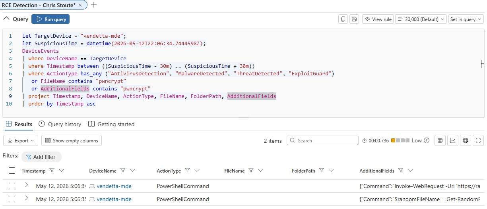

**Finding:** There was no direct malware detection event shown, but related PowerShell telemetry was present.

---

### Step 13 - Extract PowerShell Command Telemetry

Finally, I expanded the PowerShell command telemetry to better understand what commands were executed.

```kql
let TargetDevice = "vendetta-mde";
let SuspiciousTime = datetime(2026-05-12T22:06:34.7444598Z);
DeviceEvents
| where DeviceName == TargetDevice
| where Timestamp between ((SuspiciousTime - 30m) .. (SuspiciousTime + 30m))
| where ActionType == "PowerShellCommand"
| extend Command = tostring(parse_json(AdditionalFields).Command)
| project Timestamp, DeviceName, ActionType, Command
| order by Timestamp asc
```

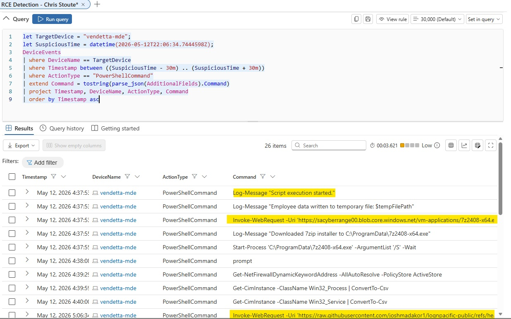

**Finding:** PowerShell telemetry showed script execution, tool download behavior, and staging activity.

Observed activity included:

```text
Invoke-WebRequest
Download of 7-Zip installer
Silent installation using Start-Process
Employee data written to a temporary file
Additional PowerShell commands executed
```

---

## Timeline Summary

| Time | Event |
|---|---|
| May 12, 2026 5:06 PM | Suspicious PowerShell activity observed on `vendetta-mde` |
| May 12, 2026 5:06 PM | `cmd.exe` launched `powershell.exe` |
| May 12, 2026 5:06 PM | PowerShell executed `C:\ProgramData\pwncrypt.ps1` |
| May 12, 2026 5:06 PM | Files containing `pwncrypt` appeared on the device |
| May 12, 2026 5:06 PM | PowerShell telemetry showed download and staging behavior |
| May 12, 2026 5:06 PM | No clear external data exfiltration confirmed in reviewed network window |

---

## MITRE ATT&CK Mapping

| Technique | ID | Evidence |
|---|---|---|
| PowerShell | T1059.001 | PowerShell executed `pwncrypt.ps1` with `ExecutionPolicy Bypass` |
| Ingress Tool Transfer | T1105 | PowerShell used `Invoke-WebRequest` to download tools/scripts |
| Data Staged: Local Data Staging | T1074.001 | PowerShell telemetry showed employee data written to a temporary file |
| Archive Collected Data: Archive via Utility | T1560.001 | 7-Zip was downloaded and installed silently |
| Data Encrypted for Impact | T1486 | Business files were renamed with the `pwncrypt` marker |
| User Execution: Malicious File | T1204.002 | Script execution occurred under the `vendetta` user context |

---

## Final Conclusion

The hunt confirmed PwnCrypt ransomware-style activity on `vendetta-mde`. File telemetry showed `pwncrypt.ps1` and multiple business-related files renamed with the `pwncrypt` marker. Process telemetry confirmed `cmd.exe` launched `powershell.exe` with `-ExecutionPolicy Bypass` to execute:

```text
C:\ProgramData\pwncrypt.ps1
```

PowerShell command telemetry showed suspicious behavior including tool download, silent installation, and data staging activity. Network activity around the execution window did not provide clear evidence of successful external data exfiltration, but local ransomware-style file impact and suspicious PowerShell automation were confirmed.

---

## Response Recommendations

Recommended response actions:

1. Isolate `vendetta-mde` from the network.
2. Preserve evidence, screenshots, and relevant KQL results.
3. Review affected files and determine recoverability.
4. Scope the `pwncrypt` IOC across all devices.
5. Review PowerShell execution policy and logging configuration.
6. Block confirmed malicious download sources in an enterprise environment.
7. Reimage or rebuild the affected VM if required by lab policy.
8. Create or tune a detection rule for future `pwncrypt` activity.

---

## Lessons Learned

This scenario demonstrated how to perform a ransomware-focused threat hunt using Microsoft Defender for Endpoint. The investigation reinforced the importance of moving from broad IOC discovery to focused device-level analysis, then pivoting across file, process, network, alert, and PowerShell telemetry.

Key takeaways:

- Start broad with known IOCs.
- Use raw event timelines to identify first-seen activity.
- Pivot from file events to process events.
- Inspect command-line execution details.
- Use PowerShell telemetry to confirm script behavior.
- Scope impact across devices.
- Validate whether network activity supports exfiltration.
- Map findings to MITRE ATT&CK for professional reporting.

---

<div align="center">


</div>
